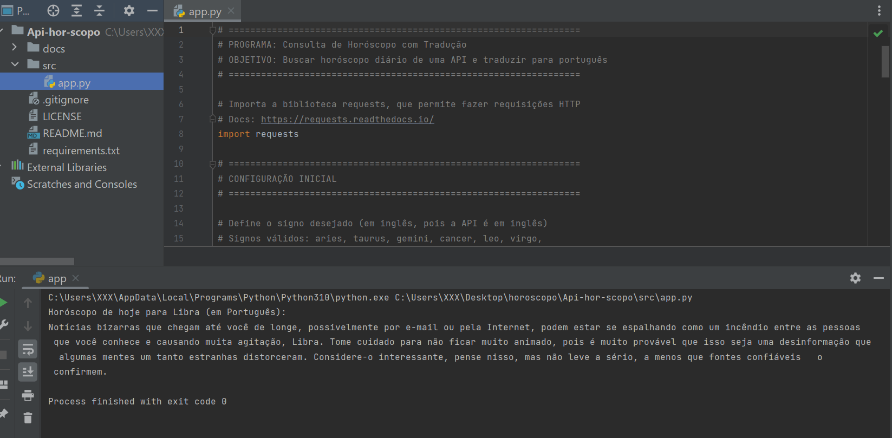

# Consulta de Horóscopo com Tradução

Uma pequena ferramenta em Python que busca o horóscopo diário para um signo em uma API pública e tenta traduzir o texto para português.

Este repositório contém um script simples (`app.py`) que demonstra:
- Requisições HTTP com `requests`.
- Processamento de JSON.
- Uso opcional da biblioteca `googletrans` para traduzir o horóscopo do inglês para o português.

## Sumário

- [Consulta de Horóscopo com Tradução](#consulta-de-horóscopo-com-tradução)
  - [Sumário](#sumário)
  - [Visão geral](#visão-geral)
  - [Requisitos](#requisitos)
  - [Instalação (Windows / PowerShell)](#instalação-windows--powershell)
  - [Como usar](#como-usar)
    - [Exemplo de saída](#exemplo-de-saída)
  - [Formato de resposta / comportamento](#formato-de-resposta--comportamento)
  - [Soluções de problemas (troubleshooting)](#soluções-de-problemas-troubleshooting)
  - [Melhorias sugeridas (próximos passos)](#melhorias-sugeridas-próximos-passos)
  - [Contribuição](#contribuição)
  - [Licença](#licença)


📂 Estrutura do projeto

Api-hor-scopo/
│── src/
│   └── main.py
│── requirements.txt
│── README.md


## Visão geral


O script principal, `app.py`, faz o seguinte fluxo:

1. Define o signo desejado (variável `signo`).
2. Faz uma requisição GET para a API pública de horóscopo.
3. Se a requisição for bem-sucedida (HTTP 200), extrai o texto do horóscopo.
4. Tenta traduzir o texto do inglês para o português usando `googletrans`.
5. Exibe o resultado traduzido (ou o original, caso a tradução falhe).

É um exemplo didático, ideal para quem quer entender integrações simples com APIs e tradução automática.

## Requisitos

- Python 3.8+ (testado com 3.8–3.11)
- Biblioteca `requests`
- Biblioteca opcional para tradução: `googletrans==4.0.0-rc1` (recomendada para este script)

Observação: a biblioteca `googletrans` é de terceira‑parte e por vezes instável. Se você tiver problemas, veja a seção de troubleshooting.

## Instalação (Windows / PowerShell)

1. Abra o PowerShell.
2. Crie e ative um ambiente virtual (opcional, recomendado):

```powershell
python -m venv .venv
.\.venv\Scripts\Activate.ps1
```

3. Instale dependências:

```powershell
pip install requests
# Instale a versão recomendada do googletrans (opcional, para tradução automática)
pip install "googletrans==4.0.0-rc1"
```

Sugestão: você pode criar um `requirements.txt` com estas linhas:

```
requests
googletrans==4.0.0-rc1
```

## Como usar

1. Abra `app.py` em um editor de texto.
2. Altere a variável `signo` para o signo desejado (em inglês):

```python
signo = "libra"  # ex: aries, taurus, gemini, cancer, leo, virgo, libra, scorpio, sagittarius, capricorn, aquarius, pisces
```

3. Execute o script no PowerShell:

```powershell
python app.py
```

Saída esperada: texto do horóscopo (em português, se a tradução funcionar) ou o original em inglês com uma mensagem de aviso.

### Exemplo de saída

Horóscopo traduzido (exemplo):

```
Horóscopo de hoje para Libra (em Português):
Hoje você terá boas oportunidades para se conectar com pessoas próximas...
```

Se a tradução falhar, o script exibirá algo como:

```
(Aviso) Não foi possível traduzir automaticamente: <erro>
Horóscopo de hoje para Libra:
Today you will have good opportunities to connect with people close to you...
```

## Formato de resposta / comportamento

- O script consulta a URL:

```
https://horoscope-app-api.vercel.app/api/v1/get-horoscope/daily?sign=<signo>
```

- Ele espera receber um JSON onde o texto do horóscopo está em `data['horoscope_data']`.
- Em caso de código HTTP diferente de 200, o script imprime o código de erro retornado pela API.
- Para tradução, o script usa `googletrans`. Caso a tradução gere uma coroutine (dependendo da versão), o script lida com ambos os casos (sincrono/assíncrono) e faz fallback para o texto original em caso de erro.


## 📸 Exemplo de execução



## Soluções de problemas (troubleshooting)


- Erro ao instalar `googletrans`:
	- Tente instalar a versão `4.0.0-rc1` explicitamente.
	- Se continuar com problemas, considere usar alternativas como `deep-translator` ou a API oficial do Google Cloud Translate (essa última é paga).

- Tradução não funciona (exceção durante tradução):
	- O script já captura exceções e exibirá o horóscopo em inglês.
	- Verifique sua conexão com a internet e se a API de horóscopo está respondendo.

- Requisição retorna código diferente de 200:
	- Verifique a URL e o signo informado.
	- Pode ser um problema temporário na API remota.

## Melhorias sugeridas (próximos passos)

- Tornar o signo um argumento de linha de comando (ex.: `python app.py libra`) usando `argparse`.
- Adicionar um `requirements.txt` e/ou `pyproject.toml` para gerenciar dependências.
- Adicionar testes unitários simples que simulem resposta da API (mock). 
- Adicionar um Dockerfile para rodar o script de forma isolada.
- Substituir `googletrans` por uma solução mais robusta (Google Cloud Translate, DeepL, etc.) se for para produção.

Exemplo rápido (melhoria): aceitar um argumento na linha de comando

```python
import sys
signo = sys.argv[1] if len(sys.argv) > 1 else "libra"
```

## Contribuição

Contribuições são bem-vindas. Para contribuir:

1. Fork este repositório.
2. Crie uma branch com sua feature: `git checkout -b feat-exemplo`.
3. Faça commits pequenos e claros.
4. Abra um pull request descrevendo a mudança.

## Licença

Veja o arquivo `LICENSE` neste repositório para detalhes da licença.

---

Se quiser, posso também:

- Gerar um `requirements.txt` automaticamente e adicioná-lo ao repositório.
- Alterar `app.py` para aceitar argumentos CLI e variáveis de ambiente.
- Adicionar um pequeno teste unitário (pytest) que valida o fluxo com mocks.

Diga qual dessas melhorias prefere que eu implemente em seguida.

Autor Hélio do Nascimento Silva
